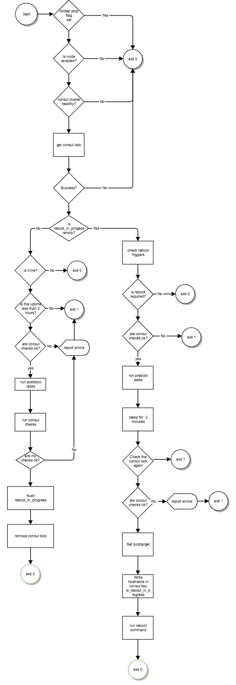

# Problem Statement
We need to reboot nodes for e.g. updates of the kernel or quobyte. Currently we do this by hand, but this already doesn't scale. Just rebooting the nodes requires a full day of work with the number of nodes we have now. It is not an option to never reboot, since we need to keep our systems up to date with the latest security or performance improvements.

We are not able to reboot the entire cluster without any coordination. At least in the first step, we only allow rebooting one node at a time. There is already a solution by CoreOS called locksmith, that solves exactly this problem. But with a limitation that is not acceptable to us: It does not allow any constraints other than the number of nodes in reboot at the same time. Another limitation, it is also tightly coupled to CoreOS and its update engine.

We need to come up with our own solution.

# Proposed Design
We will create a cli tool and a systemd service rebootmgr (for now), which is designed to run on every node, every 5 Minutes.
 We need to take care, that only one instance is running at the time. We use consul to coordinate the reboot and to check the required services.

We have the following constraints:

- Don't reboot, if another reboot is currently in progress
- Never reboot a gateway/loadbalancer if there is only one
- Never reboot a controller if there are less than 3
- Never reboot a controller if
   - the galera is not healthy
   - zookeeper is not healthy
   - cassandra-cluster is not healthy
   - rabbitmq is not ok
- Never reboot a compute with running VMs
- Never reboot if "dkms status" is not ok
- Never reboot a compute/controller node when quobyte is not "green"
- Never reboot a node that is currently updating

Some of this is a larger task than the other one. E.g. we even don't want to reboot a controller if one galera service is not available, but the rest is. For compute nodes we need to talk to the OpenStack API to evacuate and disable the node. We may as well query virsh list for still running VMs, and do not proceed before the node is in fact empty.

We already register important services to the consul service discovery. We can reuse the check mechanism built into the service discovery, to get the health of the services.

## Reboot events

The rebootmgr should reboot a node when either of the following is true
- the file `/var/run/reboot_required` exists
- the consul key `/service/rebootmgr/<node>/reboot_required` exists
- an operator runs `rebootmgr` on the commandline

## Pre- and Post-reboot tasks

Different kinds of nodes need different kinds of preparation before rebooting. For example on compute nodes, we need to talk to the OpenStack API to evacuate and disable the node. We may as well query virsh list for still running VMs, and do not proceed before the node is in fact empty. After the reboot we want to re-enable the node.

We will accomplish this with a simple task system: Tasks are simple scripts and are located in `/etc/rebootmgr/pre_boot_tasks` and `/etc/rebootmgr/post_boot_tasks`. The scripts in this directories are executed in alphabetical order. When a script fails with an exit code > 0, rebootmgr exits.

## Consul checks

Rebootmanager will consider only checks with the tag `rebootmgr`. Every command needs a timeout of 2 minutes, the maximum interval is one minute. The rebootmgr has to wait for more than 2 minutes (timeout + interval) after the pre_boot_checks were executed.

The consul Services may have additional tags:

- `ignore_maintenance`: Consul adds  a check with the id "_node_maintenance" if a node is in maintenance mode. This check is ignored if the tag is present.
- `min_passing=<number>`: Rebootmgr will only consider the service healthy, if a minimum of `<number>` nodes in the cluster report the service to be healthy.
- `max_failing=<number>`: Rebootmgr will only consider the service healthy, if a maximum of `<number>` nodes in the cluster report the service to be failing.

## Global stop flag

If something goes wrong, we want to be able to stop rebootmgr as fast as possible. It should not do anything anymore when `service/rebootmgr/stop` is set in the consul kv store, regardless of the content.

## Flow Diagram

